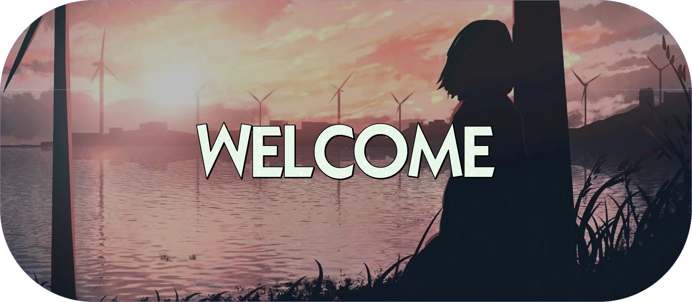

<p align="center">
  <a href="https://vk.com/devildesigner"></a>
</p>
<h1 align="center">
  <strong>👋 Hi there!
</h1>

I'm a beginner software developer based in Kazakhstan.  You can find me on [Discord](https://discord.gg/m4rCgqV5A2).
I'm also an open-source enthusiast and maintainer. i learned a lot from the open-source community and i love how collaboration and knowledge sharing happened through open-source.
</h1>

&nbsp;

<h1>
    <div align="center">
    
    </a>    
<p align="center">
  <strong><a href="https://vk.com/devildesigner">VK</a></strong> |
  <strong><a href="https://discord.gg/m4rCgqV5A2">Discord</a></strong>
</p><strong>
</h1>

&nbsp;
<h1> 
<p><strong>🧰 &nbsp;My toolbox

 &nbsp;
 &nbsp;
 &nbsp;
 &nbsp;
 &nbsp;
 &nbsp;
 &nbsp;
</p>

<p><strong>🔥&nbsp;GitHub Stats


</p>

<p><strong>💻&nbsp;Code Stats

[](https://github.com/neverminddev/discord.RichPresence)
[](https://github.com/neverminddev/github-readme-stats)
</p>

<p><strong>✨&nbsp;GitHub Awards 

[](https://github.com/neverminddev/github-profile-trophy)


[](https://github.com/neverminddev/open-source-badge/)
</p>

</p></h1>
  <details>
    <summary>
      More information:
    </summary>
  <br>
    <small>
      <!--START_SECTION:waka-->
📊 **This Week I Spent My Time On** 

```text
⌚︎ Time Zone: Asia/Almaty

🔥 Editors: 
No Activity Tracked This Week

💻 Operating System: 
No Activity Tracked This Week

```


 Last Updated on 19/10/2022 02:47:27 UTC
<!--END_SECTION:waka-->
  </br>
</h1></p>